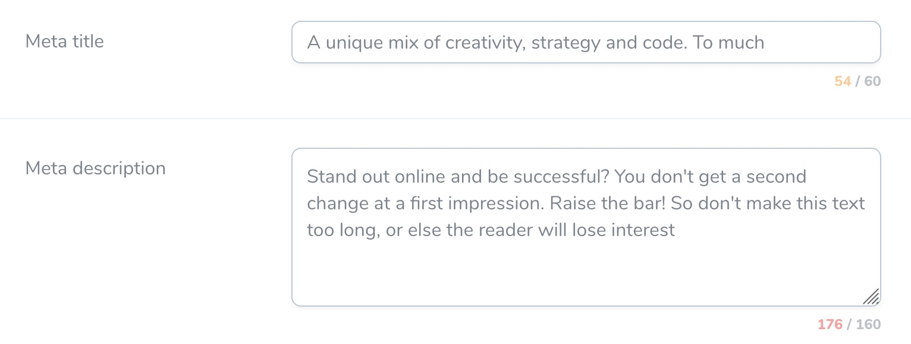

# Nova Charcounter Fields

Text and textarea fields with a character counter for Laravel Nova.

### Installation

Add the GitHub URL to your repositories list in `composer.json`:

```
"repositories": [
  {
    "type": "vcs",
    "url": "git@github.com:optimistdigital/nova-charcounted-fields.git"
  }
]
```

You can require this package using composer:

`composer require elevate-digital/nova-charcounted-fields`

# Usage

You can add the field with a resolver as follows:

```
use ElevateDigital\CharcountedFields\TextCounted;
use ElevateDigital\CharcountedFields\TextareaCounted;

TextCounted::make('Meta title')
```


You can use the text and textarea fields with charactercounters on you Nova model. The max number of characters aren't enforced, but just encouraged with warning colors and the counter. (You could enforce the max number of characters with Nova's built in _rules_ and with a _maxlength_ extra attribute).

```php
TextCounted::make('Meta title')
    ->maxChars(60)
    ->warningAt(50)
    ->withMeta(['extraAttributes' => ['maxlength' => '65']]),

TextareaCounted::make('Meta description')
    ->maxChars(160)
    ->warningAt(150)
    ->rows(3),
```

The maxChars and warningAt are both optional. The color of the counter will change when the max or warningAt limit is reached.

